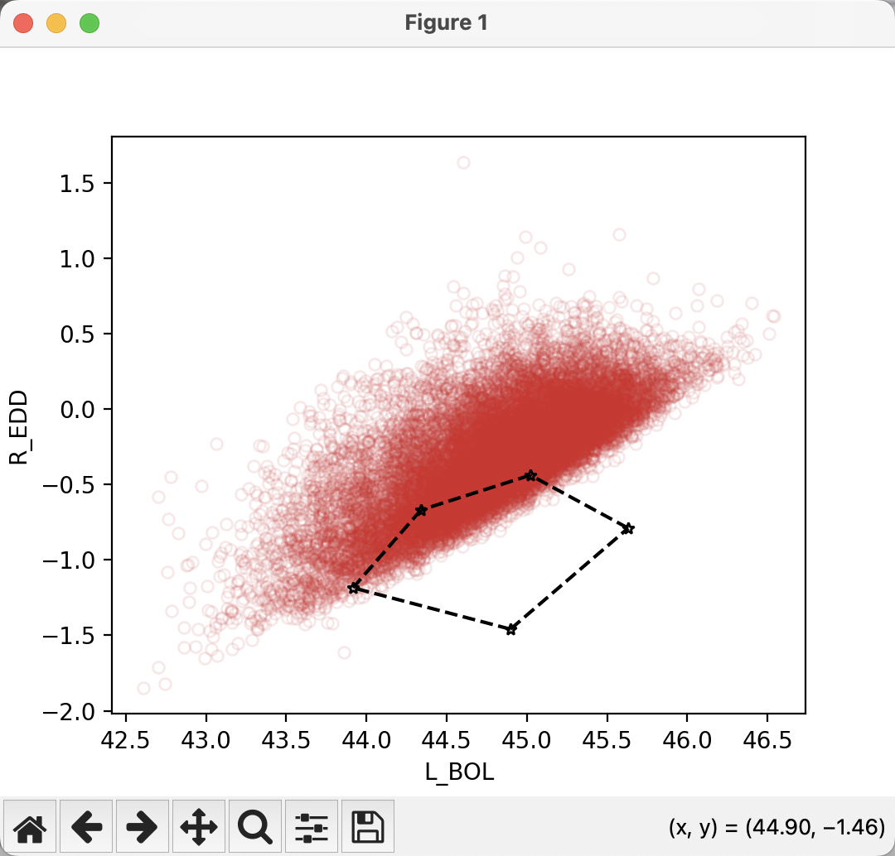
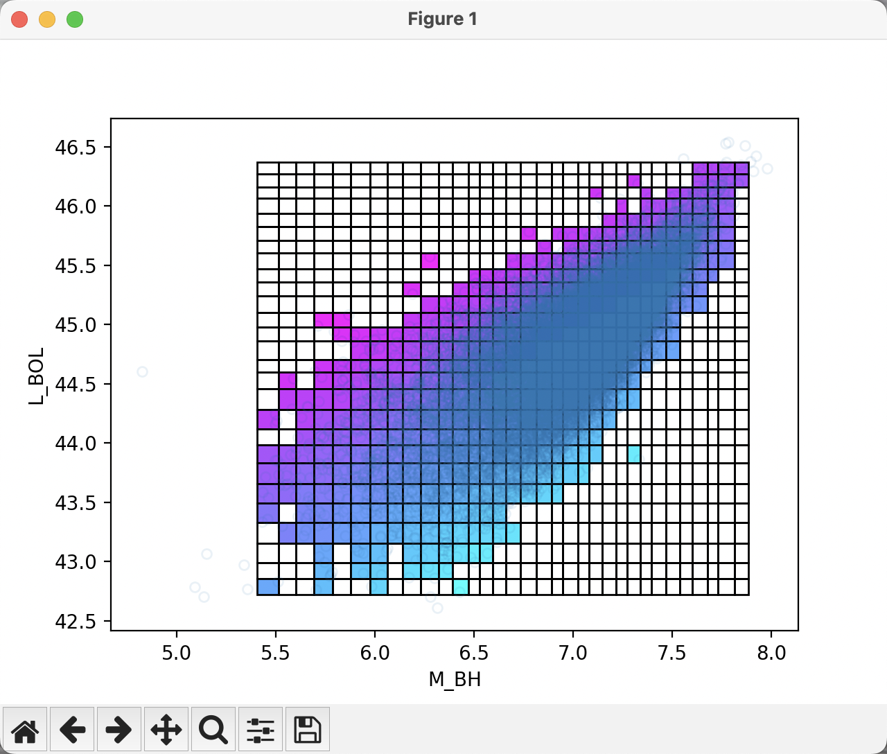

# Easy Cat

## Installation
```shell
$ pip install git+https://github.com/AstroJH/easycat.git
```

## Select subsamples within a polygonal region
```Python
from pandas import DataFrame
import matplotlib.pyplot as plt
from easycat.subcat2d.polygon import PolygonGuiSelector

def load_catalog() -> DataFrame:
    pass # code implementation for loading catalog

catalog:DataFrame = load_catalog()

selector = PolygonGuiSelector([catalog], "attr1", "attr2")
plt.show() # select region by GUI...


subsamples = selector.get_subsample()
```
After calling function `subcat2d.get_subsample`, the GUI generated by Matlotlib will pop up, and you can select the polygonal region by clicking the left mouse button to get the subsamples within the region.



## Make 2D color bar relation
```Python
from easycat.subcat2d.grid import GridGuiSelector
import matplotlib.pyplot as plt
from pandas import DataFrame

def load_catalog() -> DataFrame:
    pass # code implementation for loading catalog

def calc_val(subsample:DataFrame) -> float:
    pass

catalog:DataFrame = load_catalog()
selector = GridGuiSelector(data=catalog, "attr1", "attr2")
plt.show()

selector.calc(mapper=calc_val)
plt.show()
```



## Common Tool for Downloading Catalog Data
```Python
from easycat.download.core import start

def handler(obj_id:str, params:dict) -> bool:
    pass

start(logpath, catalog, handler, n_workers=10)
```

## Structure Function for AGN
TODOing...


## Download WISE Data
### Case1: Single infrared object
```Python
from easycat.download import WISEDataDownloader
from astropy import units as u

downloader = WISEDataDownloader(radius=3*u.arcsecond, store_dir="./wise_data/")
is_successful = downloader.download("filename", raj2000=114.2125, dej2000=65.6025)
```

### Case2: Multiple infrared objects
```Python
import pandas as pd
from easycat.download import WISEDataDownloader
from astropy import units as u

catalog = pd.DataFrame(
    data={
        "obj_id": ["A000", "B001", "C101"],
        "raj2000": [0.047549, 0.09689882, 0.2813572],
        "dej2000": [14.92935, 19.45895, 0.4404623],
        # More columns ...
    },
)
catalog.set_index(keys="obj_id", inplace=True)

downloader = WISEDataDownloader(radius=3*u.arcsecond, store_dir="./test_store_dir",
                                catalog=catalog, logpath="./test.log.npy")
downloader.download()
```

> **Tip**
> You can create the `catalog` by reading from Excel Table or other local file.

## Download ZTF Lightcurve
```Python
downloader = ZTFLightcurveDownloader(
    radius=3*u.arcsecond,
    store_dir="./test_store_dir",
    catalog=catalog,
    logpath="./test.log.npy",
    n_works=10)

downloader.download()
```